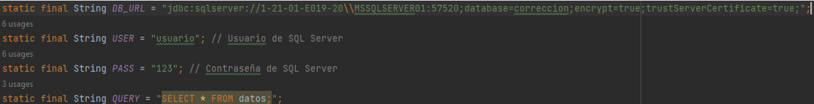
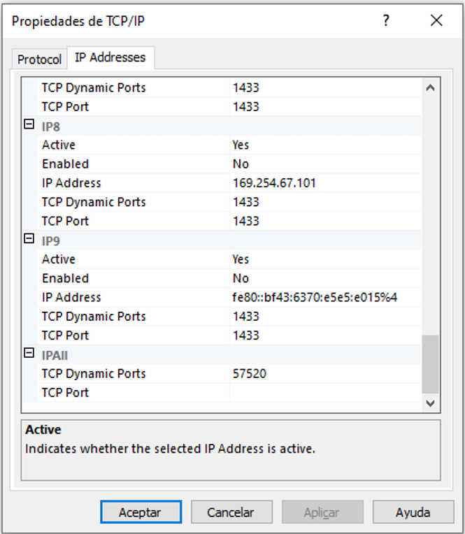

### Cataña Dennis
### Cocha Iveth
### Paredes Miguel
### Simba Cristian

## Instalar la libreria

## Crear una base de datos en SQL Manager

## Credenciales necesarias para conectarse a SQL

## Configuracion para la conexion de la base de datos 

## Verificacion de la conexion

## Creacion de variables para establecer la conexion

## Creacion de una funcion que se conecte a la base

## Configurar el SQl Server Configuration Manager

## Verificacion del puerto 

## Ingreso de valores

## Verificacion en la base de datos

